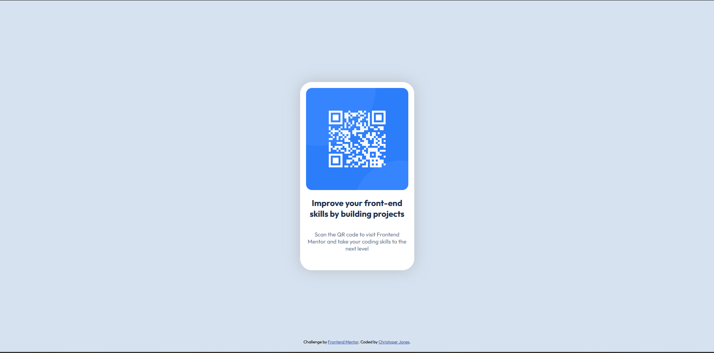

# Frontend Mentor - QR code component solution

This is a solution to the [QR code component challenge on Frontend Mentor](https://www.frontendmentor.io/challenges/qr-code-component-iux_sIO_H).

## Table of contents

- [Overview](#overview)
  - [Screenshot](#screenshot)
  - [Links](#links)
- [My process](#my-process)
  - [Built with](#built-with)
  - [What I learned](#what-i-learned)
  - [Continued development](#continued-development)
- [Author](#author)

## Overview

### Screenshot



### Links

- Solution URL: (https://github.com/cj6046/FrontendMentor/tree/main/qr-code)
- Live Site URL: (https://cj6046.github.io/FrontendMentor/qr-code/)

## My process

### Built with

- Semantic HTML5 markup
- CSS custom properties
- Flexbox

### What I learned

I went over a lot of the basics in this one. Primarily, I learned about the box model and then utilized flexbox. The CSS I'm most proud of in this one is learning how to center a div! (Until I have to google how to again...)

```css
.body {
  ...
  display: flex;
  justify-content: center;
  align-items: center;
  ...
}
```

### Continued development

I definitely want to continue working with flexbox to understand all of its nuances, but I feel comfortable with it enough to move onto things like Grid.

## Author

- Frontend Mentor - [@cj6046](https://www.frontendmentor.io/profile/cj6046)
